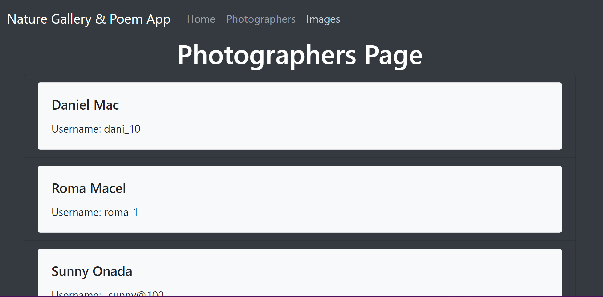

# Express App with Pug Templates

## Table Of Contents
1. [Description](#description)
2. [Directory Structure](#directory-structure)
3. [Instructions](#instructions)
4. [Objectives](#objectives)
5. [Pre-requisites](#pre-requisites)
6. [Requirements](#requirements)
7. [Screenshots](#screenshots)
8. [Getting Started](#getting-started)


### Description 
Nature Gallery & Poem web application to display wonderful nature images and poems about nature. This application was built using Pug View Template and Express Server on Node.js runtime environment. This assessment measures your understanding of Node and Express and your capability to implement their features in a practical manner. 

### Directory Structure
```
sba_318/
|-- data/
|   |-- imageDetails.js
|   |-- nature.js
|   |-- users.js
|-- middlewares/
|   |-- customHeaderMiddleware.js
|   |-- errorMiddleware.js
|   |-- maintenanceMiddleware.js
|   |-- versionHeader.js
|-- public/
|   |-- css/
|   |   |-- styles.css
|   |-- icon/
|   |   |-- icon.jpg
|   |   |-- maintenance.jpg
|   |-- nature/
|-- routes/
|   |-- imageDetails.js
|   |-- images.js
|   |-- index.js
|   |-- users.js
|-- views/
|   |-- details.pug
|   |-- footer.pug
|   |-- images.pug
|   |-- index.pug
|   |-- layout.pug
|   |-- maintenance.pug
|   |-- navbar.pug
|   |-- users.pug
|-- .gitignore
|-- app.js
|-- package-lock.json
|-- package.json
|-- README.md

```

### Instructions
You will create a small Node and Express server application. The topic and content of this application is entirely up to you; be creative!

Your work will be graded according to the technical requirements listed in the following section. Creativity and effort always work in your favor, so feel free to go beyond the scope of the listed requirements if you have the time.


### Objectives
- Create a server application with Node and Express.
- Create a RESTful API using Express.
- Create Express middleware.
- Use Express middleware.
- Use a template engine to render views with Express.

### Pre-requisites
- Understanding of Pug View Templates.
- Understanding of Bootstrap or CSS.
- Understanding of JavaScript.
- Understand how to get data from a local data file.
- Understand how to display data from local data array.

### Requirements
The requirements listed here are ***absolute minimums***. Ensure that your application meets these requirements before attempting to further expand your features.

| ***Requirement*** | ***Weight***    |
|:--------------|-----------|
|Create and use at least two pieces of custom middleware.| 5%     |
| Create and use error-handling middleware.   | 5%  |
| Use at least three different data categories (e.g., users, posts, or comments).  | 5%  |
| Utilize reasonable data structuring practices. | 5%     |
| Create GET routes for all data that should be exposed to the client.    | 5%  |
| Utilize route parameters, where appropriate.| 5%     |
| Adhere to the guiding principles of REST. | 10%  |
| Create and render at least one view using a view template and template engine. This can be a custom template engine or a third-party engine.
If you are stuck on how to approach this, think about ways you could render the current state of your API's data for easy viewing.| 8%     |
| Use simple CSS to style the rendered views.
Note: This is not a test of design; it is a test of serving static files using Express. The CSS can be very simple. | 2%     |
| Utilize reasonable code organization practices.   | 5%  |
| Ensure that the program runs without errors (comment out things that do not work, and explain your blockers - you can still receive partial credit).  | 10%  |
| Commit frequently to the git repository.    | 5%  |
| Include a README file that contains a description of your application.    | 2%  |
|Level of effort displayed in creativity, presentation, and user experience. | 5% |


### Screenshots
#### Home Page


#### Photographers Page



#### Nature Gallery Page


#### Nature Gallery Poem


##